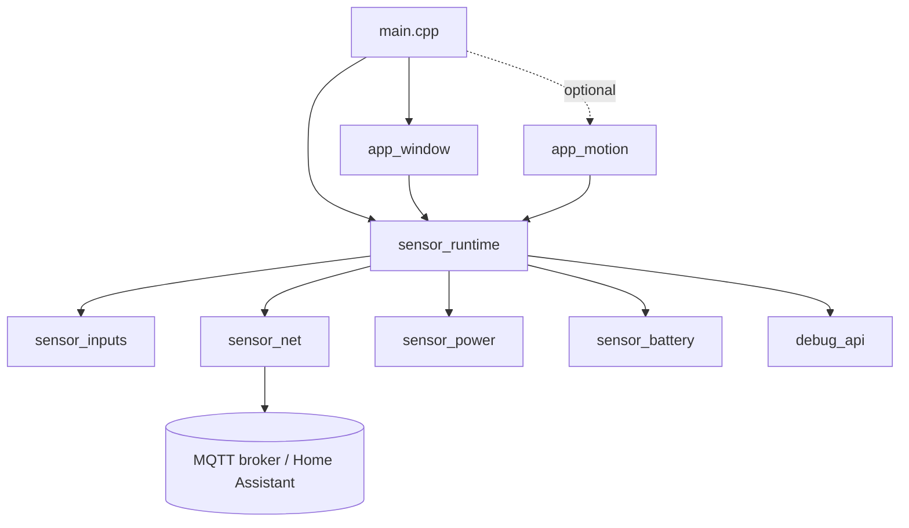

# ApexHA C1 - WiFi window sensor

Battery-powered window contact sensor for Home Assistant, based on the **Seeed Studio XIAO ESP32-C5**. It reports the window state over MQTT, sleeps between events, and wakes up immediately when the window opens or closes.

- Reed contact on D1 (window `open` / `closed`), optional IR/PIR motion input on D2
- MQTT with retained states and Home Assistant auto-discovery
- Deep sleep with wake-up on the reed contact and a 6 h heartbeat
- Stays connected 20 s after a state change, so quick follow-up changes are published without reconnecting
- Long-range WiFi settings (2.4 GHz, 802.11ax, HT20, 20 dBm) and optional 5 GHz fallback network
- Battery voltage and percentage, WiFi diagnostics (RSSI, SSID, IP, MAC) and firmware version as entities
- USB serial debug API at 115200 baud

Firmware version: see [include/fw_version.h](include/fw_version.h).

## Hardware

| Signal | XIAO pin | GPIO | Notes |
|---|---|---|---|
| Reed contact | D1 | GPIO0 (LP GPIO) | Reed between D1 and GND, pull-up to 3V3. Can wake the chip from deep sleep. |
| IR / PIR (optional) | D2 | GPIO25 | Push-pull 3.3 V output to D2 (internal pull-down). Wakes from light sleep only. Never connect a 5 V output. |
| Battery | BAT+/BAT- | GPIO6 (ADC), GPIO26 (divider enable) | On-board 1:2 divider, measured once per wake-up before WiFi starts. |

### Reed wiring


| Magnet | Reed contact | D1 | Reported as |
|---|---|---|---|
| Near | closed | LOW | `closed` |
| Away | open | HIGH | `open` |

Two pull-up options, selected with `CFG_REED_PULL` in [include/wifi6_sensor_config.h](include/wifi6_sensor_config.h):

| Option | `CFG_REED_PULL` | Current with window closed |
|---|---|---|
| Internal pull-up (~45 kΩ), no external parts | `INPUT_PULLUP` | ~70 µA |
| External 1 MΩ from 3V3 to D1 (+ optional 10 nF D1-GND), recommended on battery | `INPUT` | ~3.3 µA |

Details, schematics and notes for NC reeds and long wires: [docs/reed_wiring.md](docs/reed_wiring.md).

## Quick start

Requirements: Python 3, Git, a USB-C cable. Commands are for Windows PowerShell.

```powershell
# 1. Local PlatformIO environment
python -m venv .venv
.venv\Scripts\pip install -r requirements-dev.txt

# 2. Credentials (git-ignored)
Copy-Item include\secrets.example.h include\secrets.h
# edit include\secrets.h: WiFi SSID/password, MQTT host/port/user/password

# 3. Build
Remove-Item Env:MSYSTEM -ErrorAction SilentlyContinue
.venv\Scripts\pio.exe run

# 4. Upload and monitor
.venv\Scripts\pio.exe run -t upload
.venv\Scripts\python.exe tools\serial_monitor.py
```

- PlatformIO data is kept inside the project (`core_dir = .pio-core`); VS Code PlatformIO IDE uses the venv core.
- `MSYSTEM` (set by Git Bash/MSYS) breaks the ESP-IDF tooling, so remove it before building.
- **Flashing a sleeping board:** the USB port disappears during sleep. Hold **BOOT**, press and release **RESET**, release **BOOT**, then upload. After upload press **RESET**. After a reset the board stays awake 60 s for flashing and debugging.

## Configuration

All settings are in [include/wifi6_sensor_config.h](include/wifi6_sensor_config.h); credentials in `include/secrets.h`.

| Setting | Default | Description |
|---|---|---|
| `CFG_DEVICE_NAME` | `"WiFi6 Window Sensor"` | Device name in Home Assistant |
| `CFG_DEVICE_ID` | `""` | Empty = `xiaoc5_<last 3 MAC bytes>` |
| `CFG_SLEEP_MODE` | `SLEEP_MODE_DEEP` | `NONE` (always on), `LIGHT`, `DEEP` |
| `CFG_HEARTBEAT_S` | `21600` | Timer wake-up and full republish (6 h) |
| `CFG_AWAKE_AFTER_STATE_MS` | `20000` | Stay connected after a state change |
| `CFG_AWAKE_AFTER_BOOT_MS` | `60000` | Stay awake after reset (flashing/debug) |
| `CFG_MAX_AWAKE_MS` | `30000` | Sleep anyway if publishing fails |
| `CFG_REED_PULL` / `CFG_REED_OPEN_LEVEL` | see file | Reed pull mode and level for `open` |
| `CFG_BATTERY_ENABLED` | `1` | Battery voltage and percentage (3.3 V = 0 %, 4.2 V = 100 %) |
| `CFG_WIFI_RANGE_TUNING` | `1` | Long-range WiFi settings, `0` = driver defaults |
| `CFG_MQTT_BASE_TOPIC` | `"apexha_sensor"` | MQTT topic prefix |
| `CFG_HA_DISCOVERY` | `1` | Home Assistant MQTT discovery |
| `CFG_DEBUG_ENABLED` | `1` | USB serial debug API |

Applications are selected in [src/main.cpp](src/main.cpp):

```cpp
void setup()
{
    runtime_init();
    app_window_init();
    // app_motion_init();   // enable the IR/PIR motion input on D2
    runtime_start();
}
```

## MQTT and Home Assistant

Base topic: `apexha_sensor/<device_id>`, e.g. `apexha_sensor/xiaoc5_a1b2c3`. All messages are retained.

| Topic | Payload |
|---|---|
| `<base>/availability` | `online` / `offline` (Last Will) |
| `<base>/window` | `open` / `closed` |
| `<base>/motion` | `detected` / `clear` (only with `app_motion_init()`) |
| `<base>/rssi` | dBm, e.g. `-63` |
| `<base>/ssid` / `ip` / `mac` | WiFi network, IPv4 address, station MAC |
| `<base>/version` | firmware version, e.g. `0.2` |
| `<base>/battery_voltage` / `battery` | volts (e.g. `3.912`) / percent |
| `<base>/attributes` | JSON: ip, rssi, channel, bssid, uptime, wake reason, counters, sleep mode, fw |

The state is published first, then all diagnostics. This happens after every connect, wake-up, heartbeat and state change.

With `CFG_HA_DISCOVERY = 1` the device and all its entities appear automatically in Home Assistant (window, WiFi signal, network, IP, MAC, firmware version, battery). Every entity has `expire_after` = 3 heartbeats (18 h), so a dead sensor becomes *unavailable*.

For a manual YAML configuration (with discovery disabled), full topic reference, discovery topics and removal of stale entities, see [docs/mqtt_topics.md](docs/mqtt_topics.md).

Test from a PC:

```sh
mosquitto_sub -h <broker> -u <user> -P <pass> -v -t 'apexha_sensor/#' -t 'homeassistant/+/xiaoc5_+/+/config'
```

## Power and sleep

| Mode | Wake sources | After wake |
|---|---|---|
| `SLEEP_MODE_NONE` | - | always connected, WiFi modem sleep |
| `SLEEP_MODE_LIGHT` | any registered input change, heartbeat timer | RAM kept, reconnect, publish |
| `SLEEP_MODE_DEEP` (default) | reed on D1 (LP GPIO), heartbeat timer | reboot, reconnect, publish |

The sensor goes to sleep once everything is published, the inputs are settled, and no awake window is active (60 s after reset, 20 s after a state change, 2 s after the last input change). A wake-up plus reconnect typically takes 1 to 3 s before the first publish.

## Debug API

USB serial at 115200 baud. Use [tools/serial_monitor.py](tools/serial_monitor.py): it does not reset the board and reconnects when the port disappears during sleep.

| Key | Command |
|---|---|
| `s` | print status |
| `p` | toggle periodic status (every 5 s) |
| `w` | toggle stay awake (disable sleep) |
| `r` | restart |
| `h` / `?` | help |

```
[     5.291] WIFI connected ssid='myssid' ip=192.168.1.50 rssi=-61 ch=6 (1681 ms)
[     5.304] MQTT connected
[     5.308] MQTT HA discovery sent
[     5.313] MQTT apexha_sensor/xiaoc5_a1b2c3/window = open ok
[    10.001] STATUS wifi=connected rssi=-61 ch=6 ip=192.168.1.50 | mqtt=connected(state=0) | inputs: reed=open(raw=1) | sleep=deep wake=reset boot=1 sleeps=0 stay_awake=0 bat=4118mV(90%) heap=186972
```

## Architecture



| Module | Role |
|---|---|
| `app_window`, `app_motion` | Applications: each describes one binary sensor (pin, debounce, payloads, HA device class) |
| `sensor_runtime` | Boot, entity registry, publish scheduling, sleep decision |
| `sensor_inputs` | Debounced digital inputs (5 ms sampling, integrator with hysteresis) |
| `sensor_net` | WiFi, MQTT, diagnostics, Home Assistant discovery |
| `sensor_power` | Light/deep sleep, wake-up sources, wake reason |
| `sensor_battery` | Battery measurement |
| `debug_api` | Serial log, status, commands |

The platform modules do not know the applications, so new sensor types can be added without changing them. Full design, interfaces, error handling and internals: [wifi6_sensor.md](wifi6_sensor.md).

## Limitations

- D2 (IR/PIR) cannot wake the chip from deep sleep; motion is reported only while awake in `SLEEP_MODE_DEEP`.
- MQTT uses plain TCP without TLS; use it only on a trusted local network, with broker credentials.
- Pulses shorter than the debounce time (50 ms reed, 30 ms IR) are ignored by design.
- New Home Assistant entities are announced once per power cycle; press RESET after adding them.

## Documentation

| Document | Content |
|---|---|
| [docs/mqtt_topics.md](docs/mqtt_topics.md) | MQTT topics, payloads, discovery, manual Home Assistant YAML |
| [docs/reed_wiring.md](docs/reed_wiring.md) | Reed switch wiring, low-power external pull-up variant |
| [wifi6_sensor.md](wifi6_sensor.md) | Module design: interfaces, internal architecture, sleep, error handling, migration notes |
| [include/fw_version.h](include/fw_version.h) | Firmware version and history |
