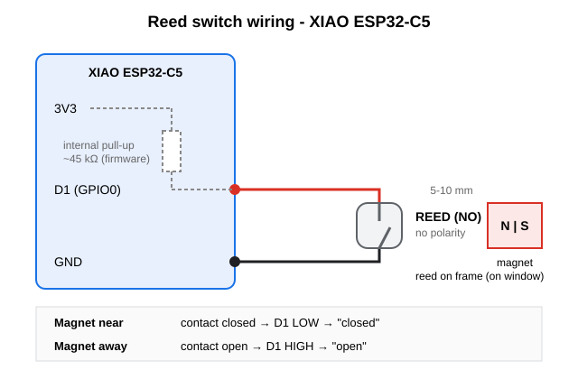

# Reed switch wiring



Connect the reed switch between **D1** and **GND**. No external parts are needed, because the firmware enables D1's internal pull-up (`CFG_REED_PULL = INPUT_PULLUP`).

```
        XIAO ESP32-C5
      ┌───────────────┐
      │  3V3          │
      │   │           │
      │ [~45k] internal pull-up (firmware)
      │   │           │
      │  D1 (GPIO0) ──┼──────────┐
      │               │       ┌──┴──┐
      │               │       │REED │  normally open (NO), no polarity
      │               │       └──┬──┘
      │  GND ─────────┼──────────┘
      └───────────────┘
```

| Magnet | Reed contact | D1   | Reported as |
|--------|--------------|------|-------------|
| Near   | closed       | LOW  | `closed`    |
| Away   | open         | HIGH | `open`      |

## Notes

- Mount the reed on the fixed frame and the magnet on the moving window, 5-10 mm apart when closed, aligned parallel.
- If you use a normally closed (NC) reed, set `CFG_REED_OPEN_LEVEL` to `LOW` in `include/wifi6_sensor_config.h`.
- For long wires (over about 1 m), add a 100 nF capacitor between D1 and GND.
- While the window is closed, about 70 µA flows through the pull-up. To reduce that, use `INPUT` mode with an external pull-up of about 1 MΩ to 3V3 (see below).

## Variant: external pull-up (low power)

The internal pull-up draws about 70 µA whenever the window is closed. An external 1 MΩ resistor cuts this to about 3.3 µA, which extends battery life.

```
        XIAO ESP32-C5
      ┌───────────────┐
      │  3V3 ─────────┼──────┐
      │               │      │
      │               │   [1 MΩ]    external pull-up
      │               │      │
      │  D1 (GPIO0) ──┼──────●──────────┬───────────┐
      │               │                 │           │
      │  (internal    │              ┌──┴──┐     ──┴──
      │   pull OFF)   │              │REED │     ──┬──  10 nF (optional)
      │               │              └──┬──┘       │
      │  GND ─────────┼─────────────────┴───────────┘
      └───────────────┘
```

Parts:

| Part      | Value  | Connected between | Purpose                             |
|-----------|--------|-------------------|-------------------------------------|
| Resistor  | 1 MΩ   | 3V3 and D1        | Pulls D1 HIGH when the reed is open |
| Reed (NO) | -      | D1 and GND        | Pulls D1 LOW when the magnet is near |
| Capacitor | 10 nF  | D1 and GND        | Optional noise filter               |

Firmware change in `include/wifi6_sensor_config.h`, which turns off the internal pull-up:

```c
#define CFG_REED_PULL               INPUT
```

Notes:

- The logic is unchanged: magnet near means LOW (`closed`), magnet away means HIGH (`open`).
- Current with the window closed is 3.3 V / 1 MΩ ≈ 3.3 µA. With the window open it is about 0.
- Keep 1 MΩ wires short (under about 30 cm), because high impedance picks up noise. For longer runs use 100-470 kΩ.
- Keep the RC time constant well below the 50 ms debounce: 1 MΩ × 10 nF = 10 ms. Do not use 100 nF with 1 MΩ.
