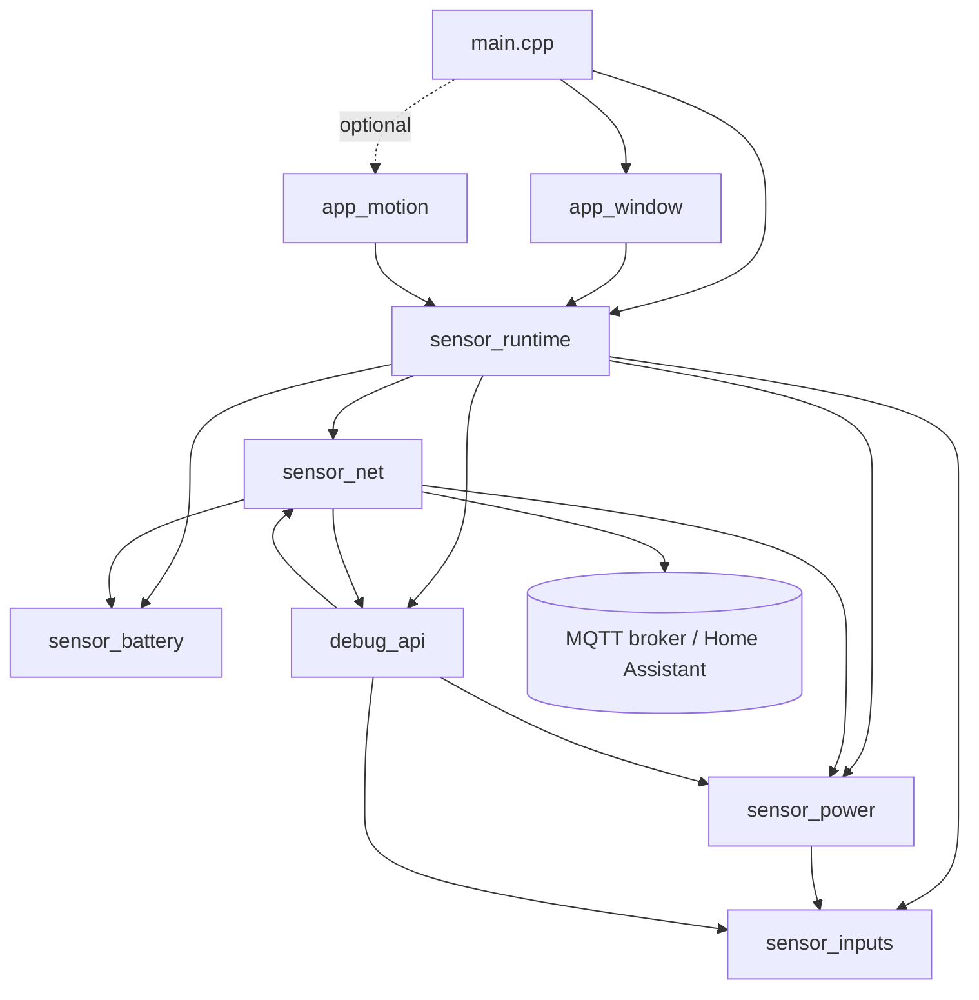

# wifi6_sensor module v1.0

<!--
HOW TO USE THIS TEMPLATE
- Copy this file next to the module source as `<module_name>.md` (e.g. database_backup.md).
- Replace every <angle-bracket> placeholder. Delete sections that truly do not apply, but keep the headings order.
- Keep it simple and human-readable. Prefer short bullet points over long paragraphs.
- This file is the single source of truth for: design (source + header), documentation, and unit tests 
- Keep it in sync with the code. If code and spec disagree, the spec is a bug until reconciled.
-->


##  General
Create a project that uses seeed studio xiao-esp32-c5 as wifi sensor for IR and reed window contact.
This .md file has to be updated with implementation

### Purpose
be careful about the platformio environment, create local penv and test if the build environment works before continuing the full implementaation.
Sensor will interfact with a mqtt broker on a local network homeassistant.
provide a documentation file to suggest mqtt topics and values.
Use wifi technology with longer range
Create a debug api that outputs states of connections and sensor input on usb serial at 115200
Create a setting defines that enables or disables the inputs.
Implement a good input debouncing

### Dependecies
use platformio configuration for this sensor. These are useful links:
https://wiki.seeedstudio.com/xiao_esp32c5_with_platformio/
https://tech.scargill.net/seeed-studio-xiao-esp32-c5-first-look/
https://www.seeedstudio.com/Seeed-Studio-XIAO-ESP32C5-p-6609.html
Use a separate secrets file for wifi settings and mqtt broker address


### Hardware Constraints
reed input on D1, create a pullup circuit
Ir input on D2, create a pull up circuit if needed
Implement sleep mode and wake up on one of this input change

### Implementation summary

#### Build environment
- Local Python venv `.venv` with `platformio==6.2.0` ([requirements-dev.txt](requirements-dev.txt)); PlatformIO core data lives in the project (`core_dir = .pio-core`).
- VS Code PlatformIO IDE uses the venv core ([.vscode/settings.json](.vscode/settings.json)).
- Build: `Remove-Item Env:MSYSTEM -ErrorAction SilentlyContinue; .venv\Scripts\pio.exe run`
- Upload: `.venv\Scripts\pio.exe run -t upload`, monitor: `.venv\Scripts\pio.exe device monitor` (115200).
- External library: `knolleary/PubSubClient@^2.8` ([platformio.ini](platformio.ini)).

#### Files
| File | Content |
|---|---|
| [include/wifi6_sensor_config.h](include/wifi6_sensor_config.h) | All setting defines (application pins, debounce, sleep mode, WiFi, MQTT, debug) |
| [include/fw_version.h](include/fw_version.h) | Firmware version `FW_VERSION` (MAJOR.MINOR, starts at `0.1`) and version history |
| [include/secrets.example.h](include/secrets.example.h) | Template for WiFi and MQTT credentials; copy to `include/secrets.h` (git-ignored) |
| [src/main.cpp](src/main.cpp) | Selects the applications: `runtime_init()`, `app_window_init()`, `runtime_start()`, then `runtime_loop()` |
| [src/app_window.cpp](src/app_window.cpp) | Window contact application: reed input on D1 -> `window` binary_sensor (`open`/`closed`) |
| [src/app_motion.cpp](src/app_motion.cpp) | Motion application: IR/PIR input on D2 -> `motion` binary_sensor (`detected`/`clear`). Not initialized by default |
| [src/sensor_runtime.cpp](src/sensor_runtime.cpp) | Application runtime: boot, entity registry, publish scheduling, sleep decision |
| [src/sensor_inputs.cpp](src/sensor_inputs.cpp) | Generic debounced digital inputs registered at runtime, input change event queue |
| [src/sensor_net.cpp](src/sensor_net.cpp) | WiFi (long-range settings), MQTT, device diagnostics topics, Home Assistant discovery |
| [src/sensor_power.cpp](src/sensor_power.cpp) | Light / deep sleep, wake-up sources, wake reason |
| [src/debug_api.cpp](src/debug_api.cpp) | USB serial debug log, status output, serial commands |
| [docs/mqtt_topics.md](docs/mqtt_topics.md) | MQTT topics, payloads, Home Assistant configuration |

#### Application architecture
The firmware is split into a platform layer (inputs, power, network, battery, debug), an application runtime, and independent applications:
- An application is a `SensorBinaryEntity` descriptor: input pin/pull/active level/debounce, MQTT payloads, MQTT leaf and Home Assistant name/device_class. It registers itself with `runtime_add_binary_sensor()`.
- The window contact application ([src/app_window.cpp](src/app_window.cpp)) and the motion application ([src/app_motion.cpp](src/app_motion.cpp)) do not know each other. The platform modules do not know any application.
- [src/main.cpp](src/main.cpp) chooses which applications run. By default only the window contact application is initialized:

```cpp
void setup()
{
    runtime_init();
    app_window_init();
    // app_motion_init();
    runtime_start();
}

void loop()
{
    runtime_loop();
}
```

#### Long range WiFi
The ESP32-C5 is a dual-band (2.4 / 5 GHz) WiFi 6 chip. The station is configured for maximum link budget with a standard access point:
- 2.4 GHz only (`CFG_WIFI_BAND_2G_ONLY`): lower path loss and better wall penetration than 5 GHz.
- 802.11b/g/n/**ax** protocols: with a WiFi 6 AP, HE ER-SU / DCM can be used for extended range.
- HT20 bandwidth: best receiver sensitivity (HT40 is not used).
- TX power 20 dBm (`CFG_WIFI_TX_POWER`, PHY maximum).
- Espressif proprietary 802.11 LR mode is **not** used, because it only works with ESP peers and not with a normal home AP.

Fallback network: if `SECRET_WIFI5_SSID` is set in `include/secrets.h`, the firmware alternates between the primary network (2.4 GHz with range tuning, otherwise any band) and the fallback network (5 GHz only) every `CFG_WIFI_CONNECT_TIMEOUT_MS`. The last network that was tried is kept in RTC memory, so after a wake-up the working network is tried first. On the first timeout, a diagnostic scan on both bands logs whether each SSID is visible.

#### Wiring
| Signal | XIAO pin | GPIO | Circuit |
|---|---|---|---|
| Reed contact | D1 | GPIO0 (LP GPIO) | Reed switch between D1 and GND. Pull-up to 3V3: internal (~45 k, default `CFG_REED_PULL = INPUT_PULLUP`) or external 100 k (then set `INPUT`). Recommended: 100 nF D1 to GND (RC filter) and 1 k in series on long wires. Window closed = magnet near = contact closed = LOW. |
| IR / PIR | D2 | GPIO25 | PIR modules (AM312, HC-SR501) have push-pull 3.3 V output: OUT to D2 with no pull-up; the internal pull-down keeps the line defined if the sensor is unplugged. For open-collector IR sensors set `CFG_IR_PULL = INPUT_PULLUP`, `CFG_IR_ACTIVE_LEVEL = LOW` (or add an external 10 k to 3V3). Never connect a 5 V output to D2. |

Power note: with the window closed, the reed pull-up draws 3.3 V / R all the time (internal ~73 uA, external 100 k = 33 uA). On battery, use an external 100 k to 330 k resistor and `CFG_REED_PULL = INPUT`.


## Interface

The public contract of each unit. Headers: [src/app_window.h](src/app_window.h), [src/app_motion.h](src/app_motion.h), [src/sensor_runtime.h](src/sensor_runtime.h), [src/sensor_inputs.h](src/sensor_inputs.h), [src/sensor_power.h](src/sensor_power.h), [src/sensor_net.h](src/sensor_net.h), [src/debug_api.h](src/debug_api.h).

### Data Types

```cpp
constexpr uint8_t SENSOR_INPUT_MAX = 4;

struct SensorInputConfig {      // static lifetime, owned by the application
    const char *name;           // log name, e.g. "reed"
    uint8_t pin, pull_mode, active_level;
    uint16_t debounce_ms;
    const char *active_name;    // e.g. "open"
    const char *inactive_name;  // e.g. "closed"
};

struct SensorInputEvent {
    uint8_t id;                 // value returned by inputs_add()
    bool active;
    uint32_t timestamp_ms;
};

struct SensorBinaryEntity {     // static lifetime, owned by the application
    SensorInputConfig input;    // active_name / inactive_name are the MQTT payloads
    const char *object;         // MQTT leaf and HA object id, e.g. "window"
    const char *label;          // HA entity name
    const char *device_class;   // HA binary_sensor device_class
};

using NetDiscoveryHandler = bool (*)();

enum WakeReason : uint8_t { WAKE_RESET = 0, WAKE_INPUT, WAKE_TIMER, WAKE_OTHER };

struct NetStatus {
    bool radio_on, wifi_connected, mqtt_connected;
    int mqtt_state;         // PubSubClient::state()
    int rssi_dbm;
    uint8_t channel;
    uint32_t ip;
    uint32_t wifi_connects, wifi_timeouts, mqtt_connects, mqtt_failures;
};
```

#### Status Codes
There is no custom status code. Functions return `bool` (true = success). `NetStatus.mqtt_state` holds the PubSubClient code (0 = connected, negative = network error, positive = broker refused).

### Public Functions

#### Applications (app_window.h, app_motion.h)
| Function | Description |
|---|---|
| `bool app_window_init()` | Registers the window contact entity (reed, `CFG_REED_*`, payloads `open`/`closed`, device_class `window`). Call between `runtime_init()` and `runtime_start()`. |
| `bool app_motion_init()` | Registers the motion entity (IR, `CFG_IR_*`, payloads `detected`/`clear`, device_class `motion`). Call between `runtime_init()` and `runtime_start()`. |

#### Runtime (sensor_runtime.h)
| Function | Description |
|---|---|
| `void runtime_init()` | `debug_init`, `power_init`, device id, `battery_init`, BOOT log, `net_init`, and registers the entity discovery handler. No radio activity. |
| `bool runtime_add_binary_sensor(const SensorBinaryEntity *entity)` | Adds the entity input to the input driver and to the entity registry. False if the table is full or the runtime is already started. |
| `void runtime_start()` | Starts input sampling, arms the boot awake window, measures the battery, and turns the radio on. |
| `void runtime_loop()` | Main loop step, see [Main loop](#main-loop). |

#### Inputs (sensor_inputs.h)
| Function | Description |
|---|---|
| `int inputs_add(const SensorInputConfig *config)` | Releases the RTC mux of an LP pad (after deep sleep), configures the pin with its pull mode, and seeds the debouncer with the current level (no event at boot). Returns the input id, or -1 if the table is full or sampling already started. |
| `void inputs_start()` | Creates the event queue and starts the 5 ms sampling timer. The input table is frozen afterwards. |
| `uint8_t inputs_count()` | Number of registered inputs; ids are `0 .. count-1`. |
| `uint8_t inputs_pin(uint8_t id)` / `inputs_pull_mode(uint8_t id)` | GPIO number / pull mode of the input. |
| `int inputs_raw_level(uint8_t id)` | Raw (not debounced) pin level. |
| `bool inputs_get_state(uint8_t id)` | Debounced logical state (true = active). Safe from any task. |
| `bool inputs_poll_event(SensorInputEvent *event)` | Non-blocking pop of the next debounced change. Returns false if the queue is empty. |
| `bool inputs_is_settled()` | True when no event is queued and each input is fully debounced with raw == stable. Used before sleep. |
| `const char *inputs_name(uint8_t id)` | Log name from the config (`"reed"`, `"ir"`). |
| `const char *inputs_state_name(uint8_t id, bool active)` | `active_name` / `inactive_name` from the config. |

#### Power (sensor_power.h)
| Function | Description |
|---|---|
| `void power_init()` | Reads the wake-up cause and increments the boot counter (kept in RTC memory). |
| `WakeReason power_last_wake_reason()` | Reason for the last start or light-sleep wake-up. |
| `const char *power_wake_reason_name(WakeReason)` | `reset` / `input` / `timer` / `other`. |
| `const char *power_sleep_mode_name()` | `none` / `light` / `deep`. |
| `uint32_t power_boot_count()` / `power_sleep_count()` | Counters (reset on power-on). |
| `bool power_can_wake_from_deep_sleep(uint8_t pin)` | True for LP (RTC) GPIOs (GPIO0-6 on the ESP32-C5). |
| `WakeReason power_light_sleep(uint32_t timer_s)` | Arms a level wake-up on every registered input (opposite of current level = wake on change) plus a timer, enters light sleep, and returns the wake reason. The caller must turn the radio off first. |
| `[[noreturn]] void power_deep_sleep(uint32_t timer_s)` | Arms EXT1 on every registered LP GPIO input (per-pin opposite of current level), keeps the pad pulls active, adds a timer, and enters deep sleep. The device restarts through `setup()`. |

#### Network (sensor_net.h)
| Function | Description |
|---|---|
| `void net_init(const char *device_id)` | Builds topics, the Home Assistant device block, and configures the MQTT client. No radio activity. |
| `void net_start()` | Radio on, applies the long-range settings, and starts a non-blocking WiFi connection. |
| `void net_stop()` | Flushes, sends a clean MQTT disconnect (no LWT), and turns the radio off. |
| `void net_loop()` | Drives the WiFi retry and MQTT connect/backoff state machine. Call every loop. MQTT connect blocks for up to about 5 s. |
| `bool net_mqtt_connected()` | MQTT session is up. |
| `bool net_mqtt_just_connected()` | True once after each new MQTT session (read clears it). |
| `bool net_publish_state(const char *leaf, const char *payload)` | Publishes `<base>/<leaf>` (retained). |
| `bool net_publish_binary_discovery(object, label, device_class, payload_on, payload_off)` | Publishes a retained Home Assistant binary_sensor config for `<base>/<object>`. |
| `void net_set_discovery_handler(NetDiscoveryHandler handler)` | Called on MQTT connect after the device diagnostics discovery, until discovery succeeded once per power cycle. |
| `bool net_publish_diagnostics()` | Publishes rssi, ssid, ip, mac, version, battery, and attributes. |
| `void net_get_status(NetStatus *status)` | Snapshot for the debug API. |
| `const char *net_base_topic()` | `apexha_sensor/<device_id>`. |

#### Debug API (debug_api.h)
| Function | Description |
|---|---|
| `void debug_init()` | Starts USB CDC serial at 115200 with a non-blocking TX. |
| `void debug_loop()` | Handles serial commands and prints the periodic status (every `CFG_DEBUG_STATUS_PERIOD_MS`). |
| `void debug_log(const char *fmt, ...)` | printf-style line with a `[sec.ms]` timestamp. |
| `void debug_print_status()` | Prints the `STATUS` and `STATS` lines. |
| `bool debug_stay_awake()` | True if the user disabled sleep with the `w` command. |

With `CFG_DEBUG_ENABLED = 0`, all debug functions are empty stubs and Serial is not started.

Serial commands: `s` status, `p` toggle periodic status, `w` toggle stay awake, `r` restart, `h`/`?` help.

Example output:
```
[     1.204] BOOT WiFi6 Window Sensor fw=0.1 id=xiaoc5_a1b2c3 wake=reset boot=1 sleep=light
[     1.210] APP window: input 'reed' on GPIO0
[     1.230] WIFI connecting to 'myssid'
[     2.911] WIFI connected ssid='myssid' ip=192.168.1.50 rssi=-61 ch=6 (1681 ms)
[     2.915] MQTT connecting to 192.168.1.10:1883
[     2.980] MQTT connected
[     5.000] STATUS wifi=connected rssi=-61 ch=6 ip=192.168.1.50 | mqtt=connected(state=0) | inputs: reed=closed(raw=0) | sleep=light wake=reset boot=1 sleeps=0 stay_awake=0 heap=231000
[     7.412] INPUT reed -> open
[     7.415] MQTT apexha_sensor/xiaoc5_a1b2c3/window = open ok
```


## Internal Architecture

### Data Type

```cpp
// sensor_inputs.cpp
const SensorInputConfig *s_config[SENSOR_INPUT_MAX];   // registered by the applications, indexed by input id
struct InputRuntime { uint8_t integrator, integrator_max; volatile bool active; };

// sensor_net.cpp
struct DiagnosticSensor { const char *object, *name, *unit, *dev_class, *icon; bool enabled; };
// kDiagnostics: rssi, ssid, ip, mac, version, battery_voltage, battery

// sensor_runtime.cpp
const SensorBinaryEntity *g_entities[SENSOR_INPUT_MAX]; // indexed by input id
bool     g_publish_all;          // publish every state + diagnostics (after connect / wake / heartbeat)
bool     g_publish_diag;         // publish diagnostics after a state change
bool     g_hold_after_full;      // woken by an input: hold awake once the full publish succeeded
uint32_t g_pending_mask;         // bit per input: change not yet published
uint32_t g_latched_active_mask;  // bit per input: went active since the last publish
uint32_t g_awake_until_ms;       // no sleep before this time (boot window, state hold)
```

RTC memory (survives deep sleep): `s_boot_count`, `s_sleep_count`, `s_discovery_sent`.

### Private Functions

| Function | File | Description |
|---|---|---|
| `sample_callback(void*)` | sensor_inputs.cpp | esp_timer callback every `CFG_DEBOUNCE_SAMPLE_MS`. Runs the integrator for each input and queues an event when the stable state flips. |
| `read_active(id)` | sensor_inputs.cpp | Raw pin level compared with the active level. |
| `map_cause(cause)` | sensor_power.cpp | `esp_sleep_wakeup_cause_t` to `WakeReason`. |
| `apply_radio_config()` | sensor_net.cpp | Band mode, protocols, bandwidth, and TX power (reapplied on every `net_start`). |
| `mqtt_try_connect(now)` | sensor_net.cpp | Connect with LWT, publish `online`, send discovery once, exponential backoff on failure. |
| `publish_discovery()` / `publish_sensor_discovery()` | sensor_net.cpp | Retained Home Assistant configs of the diagnostic sensors (measurement or text sensor), then the application discovery handler. |
| `publish_attributes()` | sensor_net.cpp | JSON diagnostics. |
| `build_device_id()` | sensor_runtime.cpp | `CFG_DEVICE_ID` or `xiaoc5_<MAC[3..5]>`. |
| `publish_entity_discovery()` | sensor_runtime.cpp | Discovery handler: binary_sensor config of every registered entity. |
| `publish_input(id, active)` / `publish_all()` | sensor_runtime.cpp | One entity state / every entity state followed by the diagnostics. |
| `hold_awake(duration_ms)` | sensor_runtime.cpp | Extends `g_awake_until_ms` (never shortens it). |
| `handle_input_events()` | sensor_runtime.cpp | Drains the event queue, sets the pending and latched masks, and logs. |
| `publish_pending()` | sensor_runtime.cpp | Publishes pending changes (active then inactive for latched short pulses), then the full state if requested. |
| `maybe_sleep()` | sensor_runtime.cpp | Sleep decision and sleep/wake sequence. |

### Boot sequence
- `runtime_init`: `debug_init` -> `power_init` (wake cause, RTC counters) -> `build_device_id` -> `battery_init` -> `net_init` -> discovery handler.
- `app_window_init` (and any other application): `inputs_add` (LP pad RTC mux release, pin mode, debouncer seed).
- `runtime_start`: `inputs_start` (queue and sampling timer) -> battery measurement -> `net_start`.
- After a reset/power-on (not a deep-sleep wake), the device stays awake for `CFG_AWAKE_AFTER_BOOT_MS` (60 s) so USB flashing and debugging are possible.

### Main loop
`runtime_loop()`:
1. `debug_loop()`: serial commands and periodic status.
2. `handle_input_events()`: debounced changes become pending bits.
3. `net_loop()`: WiFi/MQTT state machine.
4. `publish_pending()`: a new MQTT session sets `g_publish_all`. Pending inputs are published first; each published change sets `g_publish_diag` and holds the device awake for `CFG_AWAKE_AFTER_STATE_MS`. Then the full state (states first, diagnostics after) or only the diagnostics are published. In `SLEEP_MODE_NONE` a full publish is forced every `CFG_HEARTBEAT_S`.
5. `maybe_sleep()`.

### Debounce algorithm
- Sampling every 5 ms from an `esp_timer` (task dispatch), independent of network blocking in the main loop.
- Saturating integrator per input: +1 when the raw level is active, -1 otherwise, clamped to [0, max] with max = `debounce_ms / 5` (reed 50 ms -> 10, IR 30 ms -> 6).
- The stable state becomes active only at max and inactive only at 0. This gives hysteresis: isolated glitches and contact bounce shorter than the debounce time never produce an event.
- The timer uses `skip_unhandled_events` so there is no burst of callbacks after light sleep.

### Sleep sequence
Sleep is entered when all of these hold: stay-awake is off, the boot window (`CFG_AWAKE_AFTER_BOOT_MS`) and the state hold (`CFG_AWAKE_AFTER_STATE_MS`) have expired, at least `CFG_AWAKE_AFTER_EVENT_MS` has passed since the last input change, all data is published, and the inputs are settled. It is also entered after `CFG_MAX_AWAKE_MS` regardless (e.g. broker unreachable), once no hold is active.

State hold: after a published state change, or after the first full publish following an input wake-up (deep or light sleep), the device stays connected for `CFG_AWAKE_AFTER_STATE_MS` (20 s). Changes in this window are published in a few ms instead of waiting for a wake-up and reconnect (1 to 3 s). Every published change restarts the window. A timer wake-up does not start the hold.

| Mode | Radio | Wake sources | After wake |
|---|---|---|---|
| `SLEEP_MODE_NONE` | on, WiFi modem sleep | - | - |
| `SLEEP_MODE_LIGHT` | off | GPIO level on every registered input (D1 and/or D2, opposite of current level), timer `CFG_HEARTBEAT_S` | RAM kept. Debouncer detects the change, radio on, reconnect, full publish. |
| `SLEEP_MODE_DEEP` (default) | off | EXT1 on registered LP GPIO inputs only (D1/GPIO0 yes, D2/GPIO25 no), timer | Reboot through `setup()`. Current states are published after connecting. |

The manual light sleep is used because `CONFIG_PM_ENABLE` (automatic light sleep with the WiFi connection kept) is disabled in the prebuilt Arduino-ESP32 libraries.

### Threading and Concurrency
- Execution contexts: Arduino loop task (all modules), esp_timer task (`sample_callback` only).
- Shared resources: the FreeRTOS queue (thread-safe) carries events from the timer task to the loop. `InputRuntime.active` is a single-byte volatile written only by the timer task. `integrator` is read by `inputs_is_settled()` as an atomic byte read.
- No ISR is used.
- Reentrancy: not reentrant; all public functions except `inputs_get_state` must be called from the loop task.

## Dependencies
- **Arduino-ESP32 3.3.7** (ESP-IDF 5.5): `WiFi`, `Serial` (USB CDC on boot), `esp_wifi`, `esp_sleep`, `driver/gpio`, `driver/rtc_io`, `esp_timer`, `esp_mac`, FreeRTOS queue.
- **PubSubClient 2.8**: MQTT 3.1.1 client.
- Configuration: [include/wifi6_sensor_config.h](include/wifi6_sensor_config.h), `include/secrets.h`.
- Platform: `platform-seeedboards` (board `seeed-xiao-esp32-c5`).

### Error Handling
- WiFi not connected within `CFG_WIFI_CONNECT_TIMEOUT_MS` -> disconnect and `WiFi.begin` again; `wifi_timeouts++`.
- WiFi lost -> auto-reconnect, timeout restarts from the moment of loss.
- MQTT connect failure -> retry with exponential backoff 2 s ... 60 s; `mqtt_failures++`; state logged.
- Publish failure -> pending bit is kept, retried in the next loop.
- HA discovery failure -> retried on the next MQTT connect.
- Radio configuration call failure -> logged, continue with driver defaults.
- Cannot publish within `CFG_MAX_AWAKE_MS` -> sleep anyway; all states are published at the next wake.
- Event queue full (16) -> event dropped, the current state is still published at the next full publish (wake/heartbeat).
- More than `SENSOR_INPUT_MAX` entities, or an application initialized after `runtime_start()` -> `runtime_add_binary_sensor` returns false and logs `APP ... cannot add input`.
- Deep sleep with an input that is not an LP GPIO -> logged at registration (`cannot wake from deep sleep`); the input is reported only while awake. With no application initialized, only diagnostics are published and the device wakes on the timer only.

## Migration and Upgrade Scenarios
- No persistent data (only RTC counters). Changing `CFG_DEVICE_ID` or `CFG_MQTT_BASE_TOPIC` creates new Home Assistant entities; remove the old retained topics on the broker.
- `CFG_REED_ENABLED` / `CFG_IR_ENABLED` were removed: select the applications in [src/main.cpp](src/main.cpp). An entity of an application that is no longer initialized is not removed automatically (see [docs/mqtt_topics.md](docs/mqtt_topics.md)).
- The new `ssid`, `ip`, `mac`, and `version` diagnostic entities are announced only after a power cycle, because discovery is sent once per power cycle.
- Firmware versioning restarts at `0.1` ([include/fw_version.h](include/fw_version.h)); the previous `CFG_FW_VERSION "1.0.0"` was removed.
- Firmware 0.2 renames the MQTT base topic from `wifi6_sensor` to `apexha_sensor`. Home Assistant entities keep their `unique_id` and follow the new topics after the discovery update; old retained `wifi6_sensor/...` messages must be cleared on the broker by hand.

## Limitations
- D2 (GPIO25) cannot wake the chip from deep sleep; in `SLEEP_MODE_DEEP` motion is reported only while awake.
- While sleeping, the USB serial port disappears. To debug, use the 60 s window after reset or the `w` command. To flash a sleeping board: hold BOOT, press RESET, then upload.
- In sleep modes the first publish after a wake-up needs a WiFi reconnect and DHCP (typically 1 to 3 s).
- MQTT uses plain TCP without TLS; intended for a trusted local network only. Use broker credentials.
- Sleep current and wake-up behaviour have been verified only by compilation; they still need to be measured on hardware.
- Pulses shorter than the debounce time (30 ms IR, 50 ms reed) are ignored by design.


## Relationship to Other Modules



The applications depend only on `sensor_runtime` and the config header. The platform modules (`sensor_inputs`, `sensor_net`, `sensor_power`, `sensor_battery`, `debug_api`) do not include any application header.

